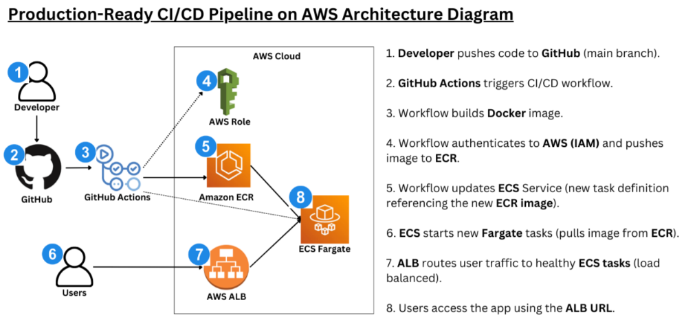

# FreshEats DevOps Pipeline

An end-to-end, production-style CI/CD pipeline on AWS using Docker, Amazon ECS Fargate, and GitHub Actions to achieve zero-downtime deployments.

---

## Overview of Project ☁️

**FreshEats**, a fast-growing food delivery startup, is rapidly adding new features to its backend services to support menus, pricing updates, and promotions.

Currently, the engineering team:
- Builds and deploys applications **manually** 
- Runs updates directly on servers
- Faces **downtime during deployments**
- Experiences inconsistent environments across releases

As the platform scales, this approach leads to:
- Slower release cycles  
- Deployment errors  
- Difficulty rolling out fixes quickly  
- Increased operational risk  

To support frequent releases and improve reliability, the team decides to adopt a **modern DevOps approach** using containerization and automated CI/CD pipelines on AWS.

---

## 🎯 Solution

This project implements a **fully automated CI/CD pipeline** that takes application code from development to production **without downtime**.

- The application is **containerized using Docker**
- Container images are stored securely in **Amazon ECR**
- The application runs on **Amazon ECS Fargate** (serverless containers)
- Traffic is managed through an **Application Load Balancer**
- Deployments are automated using **GitHub Actions**

Every code change pushed to GitHub automatically:
1. Builds a new container image
2. Pushes it to ECR 
3. Deploys the updated version to ECS 

This ensures **consistent deployments, faster releases, and production-grade reliability.**

---

## Architectural Diagram

  

---
