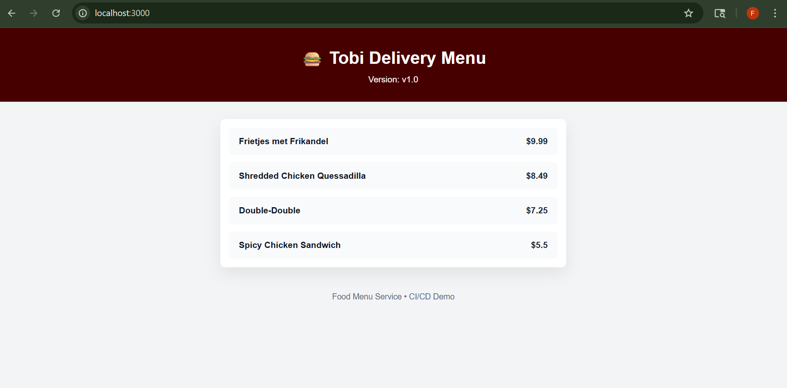
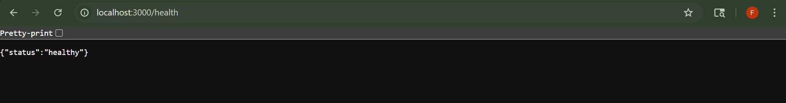
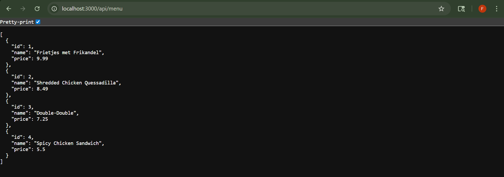
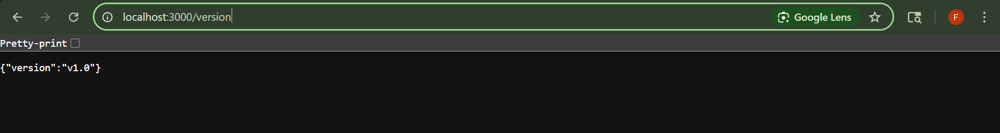

# FreshEats DevOps Pipeline

An end-to-end, production-style CI/CD pipeline on AWS using Docker, Amazon ECS Fargate, and GitHub Actions to achieve zero-downtime deployments.

---

## Architectural Diagram
<p align="center">
  
</p>

---

## Overview of Project ☁️

**FreshEats**, a fast-growing food delivery startup, is rapidly adding new features to its backend services to support menus, pricing updates, and promotions.

Currently, the engineering team:
- Builds and deploys applications **manually**
- Runs updates directly on servers
- Faces **downtime during deployments**
- Experiences inconsistent environments across releases

As the platform scales, this approach leads to:
- Slower release cycles
- Deployment errors
- Difficulty rolling out fixes quickly
- Increased operational risk

To support frequent releases and improve reliability, the team decides to adopt a **modern DevOps approach** using containerization and automated CI/CD pipelines on AWS.

---

## 🎯 Solution

This project implements a **fully automated CI/CD pipeline** that takes application code from development to production **without downtime**.

- The application is **containerized using Docker**
- Container images are stored securely in **Amazon ECR**
- The application runs on **Amazon ECS Fargate** (serverless containers)
- Traffic is managed through an **Application Load Balancer**
- Deployments are automated using **GitHub Actions**

Every code change pushed to GitHub automatically:
1. Builds a new container image
2. Pushes it to ECR
3. Deploys the updated version to ECS

This ensures **consistent deployments, faster releases, and production-grade reliability.**

---

## 1.2 Application Overview & Local Verification

Before containerization and CI/CD automation, the application was validated to ensure it runs correctly in a local development environment.

This mirrors real-world DevOps practices, where applications must be fully understood and verified **before** being automated and deployed to production infrastructure.

### Application Structure

```
food-menu-service/
├── public/
│   └── index.html     # Static UI
├── server.js          # Express server (entry point)
├── package.json       # Dependencies and start script
└── package-lock.json
```

- **Backend:** Node.js + Express API
- **Frontend:** Static HTML UI served by the backend
- **Deployment Model:** Single service deployed later as one container

---

### Backend API Endpoints

| Endpoint | Purpose |
|--------|--------|
| `/api/menu` | Returns menu items |
| `/health` | Health check for load balancers |
| `/version` | Displays the deployed application version |

These endpoints support:
- Load balancer health checks
- CI/CD validation steps
- Deployment verification

---

### Running the Application Locally

```bash
npm install
npm start
```

---

Once running, the service is available at:

- **UI:** http://localhost:3000
<p align="center">
  
</p>

---

- **Health Check:** http://localhost:3000/health
<p align="center">
  
</p>

---

- **Menu API:** http://localhost:3000/api/menu
<p align="center">
  
</p>

---

- **Version:** http://localhost:3000/version
<p align="center">
  
</p>

---

### Local Verification

The static UI fetches data from the backend API and displays:
- The food menu
- The current application version

This allows visual confirmation of deployments, similar to production release validation.

Only after this verification does the project proceed to containerization and CI/CD automation.

---
